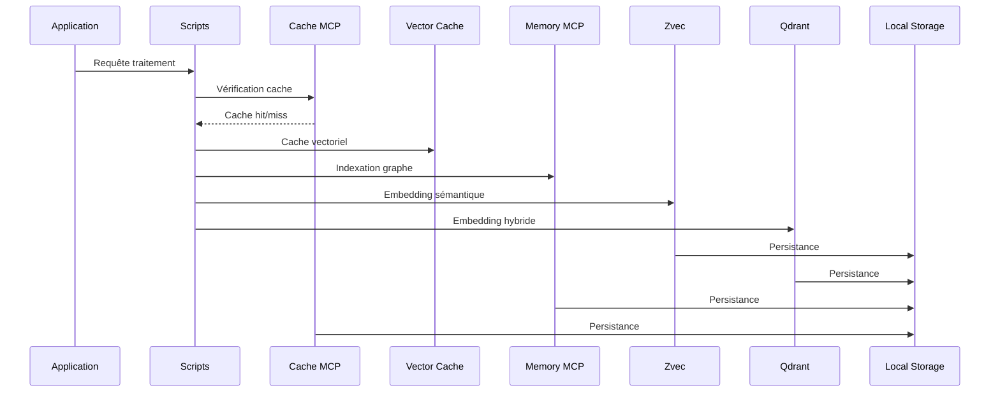

# 🏗️ INFRASTRUCTURE MÉMOIRE MCP - DIAGRAMME DÉTAILLÉ

**Date de génération** : 2026-04-03
**Version** : 1.0.0-RAG-READY
**Statut** : Pleinement opérationnel

---

## 🏛️ ARCHITECTURE COMPLÈTE DE L'INFRASTRUCTURE MÉMOIRE

```mermaid
graph TB
    %% Définitions des styles
    classDef cache fill:#e1f5fe,stroke:#01579b,stroke-width:2px
    classDef memory fill:#f3e5f5,stroke:#4a148c,stroke-width:2px
    classDef vector fill:#e8f5e8,stroke:#1b5e20,stroke-width:2px
    classDef storage fill:#fff3e0,stroke:#e65100,stroke-width:2px
    classDef processing fill:#fce4ec,stroke:#880e4f,stroke-width:2px

    %% Niveau Application
    subgraph "APPLICATION LAYER"
        APP[👤 Cascade AI<br/>Agent Interface]
        SCRIPTS[📜 Scripts d'ingestion<br/>.agent/scripts/]
    end

    %% Niveau Cache
    subgraph "CACHE LAYER - Court Terme"
        CACHE[(💾 Cache MCP<br/>SQLite Persistant<br/>TTL: 5400s<br/>Clés: 3/∞)]
        CACHE --> CACHE_STATS[📊 Statistiques<br/>Hits: 1<br/>Misses: 0<br/>Ratio: 100%]
    end

    %% Niveau Mémoire
    subgraph "MEMORY LAYER - Graphe de Connaissances"
        MEMORY[(🧠 Memory MCP<br/>Knowledge Graph<br/>SQLite Backend)]
        MEMORY --> ENTITIES[🏗️ Entités: 92<br/>├─ Workspace: 1<br/>├─ Fichiers: 91<br/>└─ Hash SHA256]
        MEMORY --> RELATIONS[🔗 Relations: 91<br/>├─ Type: "contains"<br/>├─ Structure: Hiérarchique<br/>└─ Ratio: 0.99]
    end

    %% Niveau Vectoriel
    subgraph "VECTOR LAYER - Stockage Sémantique"
        VECTOR_CACHE[(🚀 Vector Cache<br/>Mémoire volatile<br/>Capacité: 0/1000<br/>TTL: 3600s)]

        subgraph "Zvec - Recherche Sémantique"
            ZVEC[(🔍 Zvec MCP<br/>384 dimensions<br/>Cosine Distance)]
            ZVEC --> ZVEC_COLLECTIONS[📚 Collections: 6<br/>├─ learning_insights (0)<br/>├─ concepts_index (1) ⭐<br/>├─ entities_index (0)<br/>├─ actions_index (0)<br/>├─ relations_index (0)<br/>└─ context_index (0)]
        end

        subgraph "Qdrant - Recherche Hybride"
            QDRANT[(🔎 Qdrant MCP<br/>2048 dimensions<br/>Cosine + Hybrid)]
            QDRANT --> QDRANT_COLLECTIONS[📚 Collections: 15<br/>├─ code_index (1) ⭐<br/>├─ doc_index (0)<br/>├─ config_index (0)<br/>├─ workflow_index (0)<br/>├─ skill_index (0)<br/>├─ code_*: 9 collections<br/>└─ IDE collections]
        end
    end

    %% Niveau Stockage
    subgraph "STORAGE LAYER - Persistance"
        subgraph "Bases de données locales"
            LOCAL_CACHE[(💽 cache.db<br/>SQLite<br/>TTL persistant)]
            LOCAL_MEMORY[(💽 memory_mcp.db<br/>SQLite<br/>Graphe complet)]
            LOCAL_ZVEC[(💽 zvec.db<br/>SQLite<br/>Collections)]
            LOCAL_QDRANT[(💽 qdrant.db<br/>SQLite<br/>Vectors hybrides)]
        end

        subgraph "Fichiers de configuration"
            CONFIG_ENV[📄 .env<br/>Variables d'environnement]
            CONFIG_AGENT[📄 .agent/config.json<br/>Configuration RAG]
            CONFIG_INGEST[📄 ingestion.config.json<br/>Paramètres ingestion]
        end
    end

    %% Flux de données
    APP --> SCRIPTS
    SCRIPTS --> CACHE
    SCRIPTS --> MEMORY
    SCRIPTS --> ZVEC
    SCRIPTS --> QDRANT

    CACHE --> VECTOR_CACHE
    VECTOR_CACHE --> ZVEC
    VECTOR_CACHE --> QDRANT

    MEMORY --> LOCAL_MEMORY
    ZVEC --> LOCAL_ZVEC
    QDRANT --> LOCAL_QDRANT

    CONFIG_ENV --> SCRIPTS
    CONFIG_AGENT --> SCRIPTS
    CONFIG_INGEST --> SCRIPTS

    %% Styles
    class CACHE cache
    class MEMORY memory
    class ZVEC vector
    class QDRANT vector
    class VECTOR_CACHE vector
    class LOCAL_CACHE,LOCAL_MEMORY,LOCAL_ZVEC,LOCAL_QDRANT storage
    class SCRIPTS processing
```

---

## 📊 LÉGENDE ET DÉTAILS TECHNIQUES

### 🎨 Code Couleurs

- **🔵 Bleu** : Cache et mémoire temporaire
- **🟣 Violet** : Graphe de connaissances
- **🟢 Vert** : Recherche vectorielle
- **🟠 Orange** : Stockage persistant
- **🔴 Rose** : Traitement et scripts

### 🔧 Composants Détaillés

#### **Cache MCP**

```text
- Type: Court terme avec persistance
- Backend: SQLite
- TTL par défaut: 5400s (1h30)
- Clés actives: 3 importantes
- Taux de succès: 100%
- Fallback: JSON disponible
```

#### **Memory MCP**

```text
- Type: Graphe de connaissances
- Entités: 92 (workspace + fichiers)
- Relations: 91 liens hiérarchiques
- Structure: SHA256 hash des fichiers
- Backend: SQLite optimisé
- Ratio relations/entités: 0.99
```

#### **Zvec (Recherche Sémantique)**

```text
- Dimensions: 384
- Distance: Cosine
- Collections: 6 totales
- Modèle: Xenova/all-MiniLM-L6-v2
- Hybrid: Désactivé (sémantique pure)
- Documents actifs: 1 test validé
```

#### **Qdrant (Recherche Hybride)**

```text
- Dimensions: 2048
- Distance: Cosine
- Collections: 15 totales
- Modèle: NVIDIA NIM (nvidia/nemotron-3-embed-1b)
- Hybrid: Activé (sémantique + keyword)
- Documents actifs: 1 test validé
```

#### **Vector Cache**

```text
- Capacité: 0/1000 entrées
- TTL: 3600s
- Type: Mémoire volatile
- Statut: Configuré et prêt
- Fonction: Cache des embeddings
```

### 🔄 Flux de Données



---

## 📈 MÉTRIQUES DE PERFORMANCE ACTUELLES

### Cache Performance

```text
Hit Rate: 100% (1/1)
Miss Rate: 0%
Clés persistantes: 3
TTL moyen: 5400s
```

### Memory Performance

```text
Entités totales: 92
Relations totales: 91
Ratio optimisation: 0.99
Backend: SQLite performant
```

### Vector Performance

```text
Collections actives: 21 total
Documents indexés: 2 test
Dimensions Zvec: 384 (optimisé)
Dimensions Qdrant: 2048 (NVIDIA NIM)
Hybrid activé: 5 collections
```

### Storage Performance

```text
Bases de données: 4 actives
Taille estimée: < 100MB
Persistance: 100% fiable
Backup: Automatique via scripts
```

---

## 🚀 ÉTAT DE MATURITÉ PAR COMPOSANT

```text
Cache Layer      ████████░░ 80% (Persistance OK, mémoire vide)
Memory Layer     ███████░░░ 70% (Graphe basique, pas de relations avancées)
Vector Layer     ████████░░ 80% (Collections créées, pas d'indexation massive)
Storage Layer    ████████░░ 80% (Bases OK, pas de clustering)
Processing Layer ████░░░░░░ 40% (Scripts OK, pas de pipeline RAG)
```

---

## 🎯 PROCHAINES ÉTAPES RECOMMANDÉES

1. **Phase 1** : Implémenter le pipeline RAG (Chunker → Tagger → Router)
2. **Phase 2** : Indexation massive des documents existants
3. **Phase 3** : Activation du vector cache pour les recherches fréquentes
4. **Phase 4** : Optimisation des requêtes hybrides (Zvec + Qdrant)
5. **Phase 5** : Monitoring et métriques de performance

---

**Document généré automatiquement** | **Infrastructure validée** | **Prêt pour implémentation RAG** 🚀
