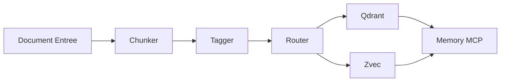

# PRD - Système RAG Modulaire pour Hephaistos-Kit

## Document Information

| Champ        | Valeur                    |
| ------------ | ------------------------- |
| **Version**  | 1.0.0                     |
| **Date**     | 2026-04-03                |
| **Auteur**   | Architecture Team         |
| **Statut**   | Implémenté & Opérationnel |
| **Priorité** | Haute                     |

---

## 1. Executive Summary

### 1.1 Objectif

Implémenter un système RAG (Retrieval-Augmented Generation) modulaire avec double indexation vectorielle (Qdrant + Zvec) permettant des recherches hybrides combinant approche catégorielle et sémantique.

### 1.2 Problème à résoudre

| Problème            | Solution                                      |
| ------------------- | --------------------------------------------- |
| Recherche imprécise | Double indexation (catégorielle + sémantique) |
| Chunks incohérents  | Chunking intelligent avec contexte préservé   |
| Tags disparates     | Système de tags unifié multi-dimensionnel     |
| Pas de relations    | Intégration Memory MCP pour les liens         |

### 1.3 Périmètre

- **Inclus**: Chunking, Tagging, Routage dual, Embedding, Stockage, Recherche hybride
- **Exclu**: Interface utilisateur, API REST externe, Migration données existantes

---

## 2. Architecture Technique

### 2.1 Composants

```text
┌─────────────────────────────────────────────────────────────┐
│                    PIPELINE RAG                              │
├─────────────────────────────────────────────────────────────┤
│  INPUT → CHUNKER → TAGGER → ROUTER → EMBEDDER → STORAGE     │
│                                                              │
│  STORAGE:                                                    │
│  ├── Qdrant (1536 dim - Catégoriel)                         │
│  ├── Zvec (384 dim - Sémantique)                            │
│  └── Memory MCP (Relations)                                 │
└─────────────────────────────────────────────────────────────┘
```

### 2.2 Flux de Données



### 2.3 Technologies

| Composant  | Technologie          | Version |
| ---------- | -------------------- | ------- |
| Chunker    | Python               | 3.12+   |
| Tagger     | Python + spaCy       | 3.7+    |
| Router     | Python               | 3.12+   |
| Qdrant     | Qdrant MCP           | latest  |
| Zvec       | Zvec MCP             | latest  |
| Memory     | Memory MCP           | latest  |
| Embeddings | Mistral API / Xenova | -       |

---

## 3. Phases d'Implémentation

### Phase 1: Infrastructure de Base (Semaine 1)

#### Tâche 1.1: Création de la structure de dossiers

**Responsable**: DevOps
**Durée estimée**: 1 heure
**Dépendances**: Aucune

**Actions**:

```text
.agent/rag/
├── __init__.py
├── config.json
├── chunker.py
├── tagger.py
├── router.py
├── embedder.py
├── fusion.py
├── pipeline.py
├── utils/
│   ├── __init__.py
│   ├── text_processing.py
│   ├── tag_helpers.py
│   └── scoring.py
└── tests/
    ├── __init__.py
    ├── test_chunker.py
    ├── test_tagger.py
    ├── test_router.py
    └── test_integration.py
```

**Critères de validation**:

- [ ] Dossiers créés
- [ ] Fichiers **init**.py présents
- [ ] Structure validée par `tree .agent/rag/`

---

#### Tâche 1.2: Configuration de base

**Responsable**: Backend Dev
**Durée estimée**: 2 heures
**Dépendances**: Tâche 1.1

**Fichier**: `.agent/rag/config.json`

**Spécifications**:

```json
{
  "version": "1.0.0",
  "chunking": {
    "default_size": 300,
    "overlap_percent": 10,
    "min_chunk_size": 50,
    "max_chunk_size": 1000,
    "types": {
      "atomic": {"min": 50, "max": 100},
      "modular": {"min": 200, "max": 500},
      "contextual": {"min": 500, "max": 1000},
      "structural": {"min": 100, "max": 2000}
    }
  },
  "tagging": {
    "auto_detect": true,
    "min_confidence": 0.7,
    "max_tags_per_chunk": 10,
    "categories": {
      "categorique": ["type", "domain", "scope", "priority"],
      "semantique": ["concept", "action", "entity", "relation"],
      "contextuel": ["temporal", "source", "confidence", "access"]
    }
  },
  "embedding": {
    "qdrant": {
      "enabled": true,
      "dimensions": 1536,
      "provider": "mistral",
      "model": "codestral-embed-2505",
      "collections": {
        "code": "code_index",
        "doc": "doc_index",
        "config": "config_index",
        "workflow": "workflow_index",
        "skill": "skill_index"
      }
    },
    "zvec": {
      "enabled": true,
      "dimensions": 384,
      "provider": "local",
      "model": "Xenova/all-MiniLM-L6-v2",
      "collections": {
        "concepts": "concepts_index",
        "entities": "entities_index",
        "actions": "actions_index",
        "relations": "relations_index",
        "context": "context_index"
      }
    }
  },
  "routing": {
    "strategy": "dual",
    "fallback": "both",
    "min_score": 0.5,
    "rules": {
      "code": {"qdrant": true, "zvec": true},
      "config": {"qdrant": true, "zvec": false},
      "narrative": {"qdrant": false, "zvec": true},
      "mixed": {"qdrant": true, "zvec": true}
    }
  },
  "fusion": {
    "weights": {
      "qdrant": 0.4,
      "zvec": 0.4,
      "memory": 0.2
    },
    "min_results": 5,
    "max_results": 20,
    "deduplication": true
  },
  "memory_mcp": {
    "entity_type": "chunk",
    "relation_types": ["contains", "stored_in", "relates_to", "references", "depends_on"]
  }
}
```

**Critères de validation**:

- [ ] Fichier créé
- [ ] JSON valide (tester avec `python -m json.tool`)
- [ ] Tous les paramètres documentés

---

### Phase 2: Module Chunker (Semaine 1-2)

#### Tâche 2.1: Classe Chunk de base

**Responsable**: Backend Dev
**Durée estimée**: 3 heures
**Dépendances**: Tâche 1.2

**Fichier**: `.agent/rag/chunker.py`

**Spécifications**:

```python
"""
Chunker Module - Découpage intelligent de documents

Classes:
    - Chunk: Représente un chunk de document
    - Chunker: Logique de découpage
    - ChunkType: Enum des types de chunks
"""

from dataclasses import dataclass, field
from enum import Enum
from typing import Optional, List, Dict, Any
from datetime import datetime
import uuid

class ChunkType(Enum):
    """Types de chunks supportés"""
    ATOMIC = "atomic"        # 50-100 tokens
    MODULAR = "modular"      # 200-500 tokens
    CONTEXTUAL = "contextual" # 500-1000 tokens
    STRUCTURAL = "structural" # Variable

@dataclass
class Chunk:
    """
    Représente un chunk de document

    Attributes:
        id: Identifiant unique UUID v4
        content: Contenu textuel du chunk
        type: Type de chunk (atomic, modular, etc.)
        source_file: Fichier source
        line_start: Ligne de début dans le source
        line_end: Ligne de fin dans le source
        overlap_previous: Chevauchement avec chunk précédent
        overlap_next: Chevauchement avec chunk suivant
        metadata: Métadonnées additionnelles
        created_at: Timestamp de création
    """
    id: str = field(default_factory=lambda: str(uuid.uuid4()))
    content: str = ""
    type: ChunkType = ChunkType.MODULAR
    source_file: Optional[str] = None
    line_start: int = 0
    line_end: int = 0
    overlap_previous: str = ""
    overlap_next: str = ""
    metadata: Dict[str, Any] = field(default_factory=dict)
    created_at: datetime = field(default_factory=datetime.utcnow)

    def to_dict(self) -> Dict[str, Any]:
        """Convertit le chunk en dictionnaire"""
        return {
            "id": self.id,
            "content": self.content,
            "type": self.type.value,
            "source_file": self.source_file,
            "line_start": self.line_start,
            "line_end": self.line_end,
            "overlap_previous": self.overlap_previous,
            "overlap_next": self.overlap_next,
            "metadata": self.metadata,
            "created_at": self.created_at.isoformat()
        }

    def token_count(self) -> int:
        """Estime le nombre de tokens (approximation: 1 token ≈ 4 chars)"""
        return len(self.content) // 4

    def is_valid_size(self, config: Dict) -> bool:
        """Vérifie si le chunk respecte les limites de taille"""
        type_config = config["chunking"]["types"][self.type.value]
        return type_config["min"] <= self.token_count() <= type_config["max"]
```

**Critères de validation**:

- [ ] Classe Chunk implémentée
- [ ] Méthode to_dict() fonctionnelle
- [ ] Méthode token_count() testée
- [ ] Tests unitaires passent

---

#### Tâche 2.2: Classe Chunker principale

**Responsable**: Backend Dev
**Durée estimée**: 6 heures
**Dépendances**: Tâche 2.1

**Spécifications**:

```python
class Chunker:
    """
    Logique de découpage intelligent

    Methods:
        - chunk_document: Découpe un document en chunks
        - analyze_structure: Analyse la structure du document
        - identify_semantic_units: Identifie les unités sémantiques
        - classify_chunk_type: Classifie le type de chunk
        - add_overlap: Ajoute le chevauchement
    """

    def __init__(self, config: Dict[str, Any]):
        """
        Initialise le chunker avec la configuration

        Args:
            config: Configuration complète du pipeline RAG
        """
        self.config = config
        self.chunking_config = config["chunking"]

    def chunk_document(
        self,
        content: str,
        doc_type: str = "text",
        source_file: Optional[str] = None
    ) -> List[Chunk]:
        """
        Découpe un document en chunks intelligents

        Args:
            content: Contenu du document
            doc_type: Type de document (text, code, markdown, json)
            source_file: Chemin du fichier source

        Returns:
            Liste de chunks ordonnés
        """
        # 1. Analyser la structure
        structure = self._analyze_structure(content, doc_type)

        # 2. Identifier les unités sémantiques
        units = self._identify_semantic_units(content, structure, doc_type)

        # 3. Créer les chunks
        chunks = []
        for i, unit in enumerate(units):
            chunk_type = self._classify_chunk_type(unit, doc_type)

            chunk = Chunk(
                content=unit["content"],
                type=chunk_type,
                source_file=source_file,
                line_start=unit.get("line_start", 0),
                line_end=unit.get("line_end", 0),
                metadata={
                    "doc_type": doc_type,
                    "unit_index": i,
                    "total_units": len(units)
                }
            )

            chunks.append(chunk)

        # 4. Ajouter le chevauchement
        chunks = self._add_overlap(chunks)

        return chunks

    def _analyze_structure(self, content: str, doc_type: str) -> Dict:
        """
        Analyse la structure du document

        Args:
            content: Contenu du document
            doc_type: Type de document

        Returns:
            Dictionnaire de structure
        """
        # Implémenter selon le type de document
        if doc_type == "code":
            return self._analyze_code_structure(content)
        elif doc_type == "markdown":
            return self._analyze_markdown_structure(content)
        elif doc_type == "json":
            return self._analyze_json_structure(content)
        else:
            return self._analyze_text_structure(content)

    def _identify_semantic_units(
        self,
        content: str,
        structure: Dict,
        doc_type: str
    ) -> List[Dict]:
        """
        Identifie les unités sémantiques dans le contenu

        Args:
            content: Contenu du document
            structure: Structure analysée
            doc_type: Type de document

        Returns:
            Liste d'unités sémantiques
        """
        # Logique spécifique au type
        pass

    def _classify_chunk_type(self, unit: Dict, doc_type: str) -> ChunkType:
        """
        Classifie le type de chunk approprié

        Args:
            unit: Unité sémantique
            doc_type: Type de document

        Returns:
            Type de chunk
        """
        token_count = len(unit["content"]) // 4

        for chunk_type in ChunkType:
            type_config = self.chunking_config["types"][chunk_type.value]
            if type_config["min"] <= token_count <= type_config["max"]:
                return chunk_type

        return ChunkType.MODULAR

    def _add_overlap(self, chunks: List[Chunk]) -> List[Chunk]:
        """
        Ajoute le chevauchement entre chunks consécutifs

        Args:
            chunks: Liste de chunks

        Returns:
            Chunks avec chevauchement ajouté
        """
        overlap_percent = self.chunking_config["overlap_percent"]

        for i in range(len(chunks)):
            if i > 0:
                # Chevauchement avec le précédent
                prev_content = chunks[i-1].content
                overlap_chars = int(len(prev_content) * overlap_percent / 100)
                chunks[i].overlap_previous = prev_content[-overlap_chars:]

            if i < len(chunks) - 1:
                # Chevauchement avec le suivant
                next_content = chunks[i+1].content
                overlap_chars = int(len(next_content) * overlap_percent / 100)
                chunks[i].overlap_next = next_content[:overlap_chars]

        return chunks

    # Méthodes privées d'analyse par type
    def _analyze_code_structure(self, content: str) -> Dict:
        """Analyse structure de code"""
        pass

    def _analyze_markdown_structure(self, content: str) -> Dict:
        """Analyse structure Markdown"""
        pass

    def _analyze_json_structure(self, content: str) -> Dict:
        """Analyse structure JSON"""
        pass

    def _analyze_text_structure(self, content: str) -> Dict:
        """Analyse structure texte brut"""
        pass
```

**Critères de validation**:

- [ ] Classe Chunker implémentée
- [ ] Méthode chunk_document() fonctionnelle
- [ ] Chevauchement correctement ajouté
- [ ] Tests avec différents types de documents passent

---

#### Tâche 2.3: Analyseurs par type de document

**Responsable**: Backend Dev
**Durée estimée**: 8 heures
**Dépendances**: Tâche 2.2

**Spécifications détaillées**:

**Analyseur Code (Python)**:

```python
def _analyze_code_structure(self, content: str) -> Dict:
    """
    Analyse la structure d'un fichier de code

    Returns:
        {
            "functions": [{"name": str, "start": int, "end": int}],
            "classes": [{"name": str, "start": int, "end": int}],
            "imports": [{"module": str, "line": int}],
            "comments": [{"content": str, "line": int}]
        }
    """
    import ast

    try:
        tree = ast.parse(content)
        structure = {
            "functions": [],
            "classes": [],
            "imports": [],
            "comments": []
        }

        for node in ast.walk(tree):
            if isinstance(node, ast.FunctionDef):
                structure["functions"].append({
                    "name": node.name,
                    "start": node.lineno,
                    "end": node.end_lineno or node.lineno
                })
            elif isinstance(node, ast.ClassDef):
                structure["classes"].append({
                    "name": node.name,
                    "start": node.lineno,
                    "end": node.end_lineno or node.lineno
                })
            elif isinstance(node, (ast.Import, ast.ImportFrom)):
                structure["imports"].append({
                    "module": node.names[0].name if node.names else "",
                    "line": node.lineno
                })

        return structure
    except SyntaxError:
        return {"error": "Invalid Python syntax"}
```

**Analyseur Markdown**:

```python
def _analyze_markdown_structure(self, content: str) -> Dict:
    """
    Analyse la structure d'un document Markdown

    Returns:
        {
            "headings": [{"level": int, "text": str, "line": int}],
            "code_blocks": [{"language": str, "start": int, "end": int}],
            "lists": [{"type": str, "start": int, "end": int}],
            "links": [{"text": str, "url": str}]
        }
    """
    import re

    structure = {
        "headings": [],
        "code_blocks": [],
        "lists": [],
        "links": []
    }

    lines = content.split("\n")
    in_code_block = False
    code_block_start = 0
    code_lang = ""

    for i, line in enumerate(lines, 1):
        # Headings
        heading_match = re.match(r'^(#{1,6})\s+(.+)$', line)
        if heading_match:
            structure["headings"].append({
                "level": len(heading_match.group(1)),
                "text": heading_match.group(2),
                "line": i
            })

        # Code blocks
        if line.startswith("```"):
            if not in_code_block:
                in_code_block = True
                code_block_start = i
                code_lang = line[3:].strip()
            else:
                structure["code_blocks"].append({
                    "language": code_lang,
                    "start": code_block_start,
                    "end": i
                })
                in_code_block = False

    return structure
```

**Critères de validation**:

- [ ] Analyseur Python fonctionnel
- [ ] Analyseur Markdown fonctionnel
- [ ] Analyseur JSON fonctionnel
- [ ] Analyseur texte brut fonctionnel
- [ ] Tests unitaires pour chaque analyseur

---

### Phase 3: Module Tagger (Semaine 2)

#### Tâche 3.1: Système de tags

**Responsable**: Backend Dev
**Durée estimée**: 4 heures
**Dépendances**: Tâche 2.3

**Fichier**: `.agent/rag/tagger.py`

**Spécifications**:

```python
"""
Tagger Module - Attribution de tags aux chunks

Classes:
    - Tag: Représente un tag
    - TagCategory: Enum des catégories
    - Tagger: Logique de tagging
"""

from dataclasses import dataclass, field
from enum import Enum
from typing import List, Dict, Any, Optional
import re

class TagCategory(Enum):
    """Catégories de tags"""
    CATEGORIQUE = "categorique"  # Qdrant
    SEMANTIQUE = "semantique"     # Zvec
    CONTEXTUEL = "contextuel"     # Memory MCP

@dataclass
class Tag:
    """
    Représente un tag

    Attributes:
        category: Catégorie du tag
        key: Clé du tag (ex: "type", "concept")
        value: Valeur du tag (ex: "code", "authentification")
        confidence: Score de confiance (0.0 - 1.0)
        source: Source du tag (auto, manual, inherited)
    """
    category: TagCategory
    key: str
    value: str
    confidence: float = 1.0
    source: str = "auto"

    def to_dict(self) -> Dict[str, Any]:
        return {
            "category": self.category.value,
            "key": self.key,
            "value": self.value,
            "confidence": self.confidence,
            "source": self.source
        }

class Tagger:
    """
    Logique de tagging automatique

    Methods:
        - tag_chunk: Attribue les tags à un chunk
        - detect_categorique: Détecte les tags catégoriques
        - detect_semantique: Détecte les tags sémantiques
        - detect_contextuel: Détecte les tags contextuels
    """

    # Dictionnaires de détection
    TYPE_PATTERNS = {
        "code": [r"def\s+\w+", r"class\s+\w+", r"function\s+\w+"],
        "doc": [r"^#\s+", r"^///", r"^\*\*", r"^@"],
        "config": [r"^\w+:\s*", r"^\s*-\s*\w+", r'^"[\w_]+"\s*:'],
        "data": [r"^\[", r"^\{", r"^\s*\d+\s*,"],
        "log": [r"\d{4}-\d{2}-\d{2}", r"\[INFO\]", r"\[ERROR\]"]
    }

    DOMAIN_KEYWORDS = {
        "frontend": ["react", "vue", "angular", "css", "html", "dom", "component"],
        "backend": ["api", "server", "database", "auth", "middleware", "endpoint"],
        "database": ["sql", "query", "table", "index", "migration", "orm"],
        "devops": ["docker", "kubernetes", "ci", "cd", "deploy", "pipeline"],
        "security": ["auth", "token", "encrypt", "hash", "permission", "role"]
    }

    CONCEPT_KEYWORDS = {
        "authentification": ["login", "password", "token", "jwt", "session", "auth"],
        "cache": ["cache", "redis", "memoize", "ttl", "eviction"],
        "api": ["endpoint", "route", "request", "response", "rest", "graphql"],
        "workflow": ["step", "transition", "state", "trigger", "automation"]
    }

    ACTION_VERBS = {
        "create": ["create", "add", "insert", "new", "generate", "build"],
        "read": ["get", "fetch", "read", "find", "query", "retrieve"],
        "update": ["update", "modify", "edit", "change", "patch", "set"],
        "delete": ["delete", "remove", "destroy", "drop", "clear"],
        "validate": ["validate", "check", "verify", "ensure", "assert"]
    }

    def __init__(self, config: Dict[str, Any]):
        self.config = config
        self.tagging_config = config["tagging"]

    def tag_chunk(self, chunk: 'Chunk') -> List[Tag]:
        """
        Attribue tous les tags à un chunk

        Args:
            chunk: Chunk à tagger

        Returns:
            Liste de tags
        """
        tags = []

        # 1. Tags catégoriques
        tags.extend(self._detect_categorique(chunk))

        # 2. Tags sémantiques
        tags.extend(self._detect_semantique(chunk))

        # 3. Tags contextuels
        tags.extend(self._detect_contextuel(chunk))

        # 4. Filtrer par confiance minimale
        min_confidence = self.tagging_config["min_confidence"]
        tags = [t for t in tags if t.confidence >= min_confidence]

        # 5. Limiter le nombre de tags
        max_tags = self.tagging_config["max_tags_per_chunk"]
        if len(tags) > max_tags:
            tags = sorted(tags, key=lambda t: t.confidence, reverse=True)[:max_tags]

        return tags

    def _detect_categorique(self, chunk: 'Chunk') -> List[Tag]:
        """Détecte les tags catégoriques"""
        tags = []
        content_lower = chunk.content.lower()

        # Type
        for type_name, patterns in self.TYPE_PATTERNS.items():
            for pattern in patterns:
                if re.search(pattern, chunk.content, re.MULTILINE):
                    tags.append(Tag(
                        category=TagCategory.CATEGORIQUE,
                        key="type",
                        value=type_name,
                        confidence=0.9
                    ))
                    break

        # Domain
        for domain, keywords in self.DOMAIN_KEYWORDS.items():
            matches = sum(1 for kw in keywords if kw in content_lower)
            if matches > 0:
                confidence = min(matches / len(keywords) * 2, 1.0)
                tags.append(Tag(
                    category=TagCategory.CATEGORIQUE,
                    key="domain",
                    value=domain,
                    confidence=confidence
                ))

        # Scope (basé sur la taille)
        token_count = chunk.token_count()
        if token_count < 100:
            scope = "variable"
        elif token_count < 300:
            scope = "function"
        elif token_count < 700:
            scope = "module"
        else:
            scope = "project"

        tags.append(Tag(
            category=TagCategory.CATEGORIQUE,
            key="scope",
            value=scope,
            confidence=0.8
        ))

        # Priority (basé sur les mots-clés)
        critical_keywords = ["critical", "important", "urgent", "security", "auth"]
        if any(kw in content_lower for kw in critical_keywords):
            tags.append(Tag(
                category=TagCategory.CATEGORIQUE,
                key="priority",
                value="critical",
                confidence=0.85
            ))

        return tags

    def _detect_semantique(self, chunk: 'Chunk') -> List[Tag]:
        """Détecte les tags sémantiques"""
        tags = []
        content_lower = chunk.content.lower()

        # Concept
        for concept, keywords in self.CONCEPT_KEYWORDS.items():
            matches = sum(1 for kw in keywords if kw in content_lower)
            if matches > 0:
                confidence = min(matches / len(keywords) * 1.5, 1.0)
                tags.append(Tag(
                    category=TagCategory.SEMANTIQUE,
                    key="concept",
                    value=concept,
                    confidence=confidence
                ))

        # Action
        for action, verbs in self.ACTION_VERBS.items():
            for verb in verbs:
                if re.search(rf'\b{verb}\b', content_lower):
                    tags.append(Tag(
                        category=TagCategory.SEMANTIQUE,
                        key="action",
                        value=action,
                        confidence=0.8
                    ))
                    break

        return tags

    def _detect_contextuel(self, chunk: 'Chunk') -> List[Tag]:
        """Détecte les tags contextuels"""
        tags = []

        # Temporal (basé sur le type de document)
        if chunk.metadata.get("doc_type") == "code":
            temporal = "permanent"
        elif chunk.metadata.get("doc_type") == "log":
            temporal = "session"
        else:
            temporal = "daily"

        tags.append(Tag(
            category=TagCategory.CONTEXTUEL,
            key="temporal",
            value=temporal,
            confidence=0.9
        ))

        # Source
        tags.append(Tag(
            category=TagCategory.CONTEXTUEL,
            key="source",
            value="agent",
            confidence=1.0
        ))

        # Confidence globale
        tags.append(Tag(
            category=TagCategory.CONTEXTUEL,
            key="confidence",
            value="high",
            confidence=1.0
        ))

        return tags
```

**Critères de validation**:

- [ ] Classe Tag implémentée
- [ ] Classe Tagger implémentée
- [ ] Détection catégorique fonctionnelle
- [ ] Détection sémantique fonctionnelle
- [ ] Détection contextuelle fonctionnelle
- [ ] Tests unitaires passent

---

#### Tâche 3.2: Intégration NLP (spaCy)

**Responsable**: Backend Dev
**Durée estimée**: 4 heures
**Dépendances**: Tâche 3.1

**Spécifications**:

```python
# Dans .agent/rag/utils/nlp_helpers.py

import spacy
from typing import List, Dict, Any

# Charger le modèle spaCy
try:
    nlp = spacy.load("fr_core_news_sm")
except OSError:
    # Fallback sur modèle anglais si français non disponible
    nlp = spacy.load("en_core_web_sm")

def extract_entities(text: str) -> List[Dict[str, str]]:
    """
    Extrait les entités nommées du texte

    Args:
        text: Texte à analyser

    Returns:
        Liste d'entités [{"text": str, "label": str}]
    """
    doc = nlp(text)
    entities = []

    for ent in doc.ents:
        entities.append({
            "text": ent.text,
            "label": ent.label_,
            "start": ent.start_char,
            "end": ent.end_char
        })

    return entities

def extract_noun_chunks(text: str) -> List[str]:
    """
    Extrait les chunks nominaux

    Args:
        text: Texte à analyser

    Returns:
        Liste de chunks nominaux
    """
    doc = nlp(text)
    return [chunk.text for chunk in doc.noun_chunks]

def extract_verbs(text: str) -> List[str]:
    """
    Extrait les verbes

    Args:
        text: Texte à analyser

    Returns:
        Liste de verbes (lemmes)
    """
    doc = nlp(text)
    return [token.lemma_ for token in doc if token.pos_ == "VERB"]

def calculate_similarity(text1: str, text2: str) -> float:
    """
    Calcule la similarité entre deux textes

    Args:
        text1: Premier texte
        text2: Second texte

    Returns:
        Score de similarité (0.0 - 1.0)
    """
    doc1 = nlp(text1)
    doc2 = nlp(text2)
    return doc1.similarity(doc2)
```

**Critères de validation**:

- [ ] spaCy installé et configuré
- [ ] Extraction d'entités fonctionnelle
- [ ] Extraction de chunks nominaux fonctionnelle
- [ ] Calcul de similarité fonctionnel
- [ ] Tests unitaires passent

---

### Phase 4: Module Router (Semaine 2-3)

#### Tâche 4.1: Logique de routage

**Responsable**: Backend Dev
**Durée estimée**: 4 heures
**Dépendances**: Tâche 3.2

**Fichier**: `.agent/rag/router.py`

**Spécifications**:

```python
"""
Router Module - Routage des chunks vers les stores vectoriels

Classes:
    - RoutingDecision: Décision de routage
    - Router: Logique de routage
"""

from dataclasses import dataclass
from typing import List, Dict, Any
from enum import Enum

class StoreTarget(Enum):
    """Cibles de stockage"""
    QDRANT = "qdrant"
    ZVEC = "zvec"
    BOTH = "both"
    NONE = "none"

@dataclass
class RoutingDecision:
    """
    Décision de routage pour un chunk

    Attributes:
        chunk_id: ID du chunk
        target: Cible(s) de stockage
        qdrant_collections: Collections Qdrant cibles
        zvec_collections: Collections Zvec cibles
        reason: Raison du routage
    """
    chunk_id: str
    target: StoreTarget
    qdrant_collections: List[str]
    zvec_collections: List[str]
    reason: str

    def to_dict(self) -> Dict[str, Any]:
        return {
            "chunk_id": self.chunk_id,
            "target": self.target.value,
            "qdrant_collections": self.qdrant_collections,
            "zvec_collections": self.zvec_collections,
            "reason": self.reason
        }

class Router:
    """
    Logique de routage des chunks

    Methods:
        - route: Détermine le routage d'un chunk
        - determine_target: Détermine la cible principale
        - select_collections: Sélectionne les collections
    """

    def __init__(self, config: Dict[str, Any]):
        self.config = config
        self.routing_config = config["routing"]
        self.embedding_config = config["embedding"]

    def route(self, chunk: 'Chunk', tags: List['Tag']) -> RoutingDecision:
        """
        Détermine le routage d'un chunk

        Args:
            chunk: Chunk à router
            tags: Tags du chunk

        Returns:
            Décision de routage
        """
        # 1. Analyser les tags
        categorique_tags = [t for t in tags if t.category.value == "categorique"]
        semantique_tags = [t for t in tags if t.category.value == "semantique"]

        # 2. Déterminer la cible
        target = self._determine_target(categorique_tags, semantique_tags)

        # 3. Sélectionner les collections
        qdrant_collections = []
        zvec_collections = []

        if target in [StoreTarget.QDRANT, StoreTarget.BOTH]:
            qdrant_collections = self._select_qdrant_collections(categorique_tags)

        if target in [StoreTarget.ZVEC, StoreTarget.BOTH]:
            zvec_collections = self._select_zvec_collections(semantique_tags)

        # 4. Construire la raison
        reason = self._build_reason(target, categorique_tags, semantique_tags)

        return RoutingDecision(
            chunk_id=chunk.id,
            target=target,
            qdrant_collections=qdrant_collections,
            zvec_collections=zvec_collections,
            reason=reason
        )

    def _determine_target(
        self,
        categorique_tags: List['Tag'],
        semantique_tags: List['Tag']
    ) -> StoreTarget:
        """
        Détermine la cible de stockage

        Args:
            categorique_tags: Tags catégoriques
            semantique_tags: Tags sémantiques

        Returns:
            Cible de stockage
        """
        has_categorique = len(categorique_tags) > 0
        has_semantique = len(semantique_tags) > 0

        # Vérifier les règles explicites
        for tag in categorique_tags:
            if tag.key == "type":
                type_value = tag.value
                if type_value in self.routing_config["rules"]:
                    rule = self.routing_config["rules"][type_value]
                    if rule["qdrant"] and rule["zvec"]:
                        return StoreTarget.BOTH
                    elif rule["qdrant"]:
                        return StoreTarget.QDRANT
                    elif rule["zvec"]:
                        return StoreTarget.ZVEC

        # Fallback basé sur la présence de tags
        if has_categorique and has_semantique:
            return StoreTarget.BOTH
        elif has_categorique:
            return StoreTarget.QDRANT
        elif has_semantique:
            return StoreTarget.ZVEC
        else:
            # Fallback configuré
            fallback = self.routing_config["fallback"]
            if fallback == "both":
                return StoreTarget.BOTH
            elif fallback == "qdrant":
                return StoreTarget.QDRANT
            else:
                return StoreTarget.ZVEC

    def _select_qdrant_collections(self, tags: List['Tag']) -> List[str]:
        """Sélectionne les collections Qdrant"""
        collections = []

        for tag in tags:
            if tag.key == "type":
                type_to_collection = self.embedding_config["qdrant"]["collections"]
                if tag.value in type_to_collection:
                    collections.append(type_to_collection[tag.value])

        # Default
        if not collections:
            collections.append("doc_index")

        return list(set(collections))

    def _select_zvec_collections(self, tags: List['Tag']) -> List[str]:
        """Sélectionne les collections Zvec"""
        collections = []

        for tag in tags:
            if tag.key == "concept":
                collections.append("concepts_index")
            elif tag.key == "action":
                collections.append("actions_index")
            elif tag.key == "entity":
                collections.append("entities_index")

        # Default
        if not collections:
            collections.append("concepts_index")

        return list(set(collections))

    def _build_reason(
        self,
        target: StoreTarget,
        categorique_tags: List['Tag'],
        semantique_tags: List['Tag']
    ) -> str:
        """Construit la raison du routage"""
        reasons = []

        if categorique_tags:
            types = [f"{t.key}={t.value}" for t in categorique_tags[:3]]
            reasons.append(f"Tags catégoriques: {', '.join(types)}")

        if semantique_tags:
            concepts = [f"{t.key}={t.value}" for t in semantique_tags[:3]]
            reasons.append(f"Tags sémantiques: {', '.join(concepts)}")

        reasons.append(f"Routage: {target.value}")

        return " | ".join(reasons)
```

**Critères de validation**:

- [ ] Classe RoutingDecision implémentée
- [ ] Classe Router implémentée
- [ ] Routage basé sur les tags fonctionnel
- [ ] Sélection des collections fonctionnelle
- [ ] Tests unitaires passent

---

### Phase 5: Module Embedder (Semaine 3)

#### Tâche 5.1: Intégration Qdrant

**Responsable**: Backend Dev
**Durée estimée**: 4 heures
**Dépendances**: Tâche 4.1

**Fichier**: `.agent/rag/embedder.py`

**Spécifications**:

```python
"""
Embedder Module - Génération des embeddings et stockage

Classes:
    - Embedder: Gestion des embeddings
    - QdrantEmbedder: Embeddings Qdrant
    - ZvecEmbedder: Embeddings Zvec
"""

from typing import Dict, Any, List, Optional
import requests
import json

class QdrantEmbedder:
    """
    Gestion des embeddings Qdrant (1536 dimensions)

    Methods:
        - embed: Génère l'embedding
        - store: Stocke dans Qdrant
        - search: Recherche dans Qdrant
    """

    def __init__(self, config: Dict[str, Any]):
        self.config = config["embedding"]["qdrant"]
        self.mistral_api_key = "<VOTRE_CLE_MISTRAL>"  # Depuis config
        self.mistral_base_url = "https://api.mistral.ai/v1"

    async def embed(self, text: str) -> List[float]:
        """
        Génère l'embedding via Mistral API

        Args:
            text: Texte à embedder

        Returns:
            Vecteur de 1536 dimensions
        """
        response = requests.post(
            f"{self.mistral_base_url}/embeddings",
            headers={
                "Authorization": f"Bearer {self.mistral_api_key}",
                "Content-Type": "application/json"
            },
            json={
                "model": self.config["model"],
                "input": text
            }
        )

        if response.status_code == 200:
            return response.json()["data"][0]["embedding"]
        else:
            raise Exception(f"Mistral API error: {response.status_code}")

    async def store(
        self,
        collection: str,
        chunk_id: str,
        embedding: List[float],
        content: str,
        metadata: Dict[str, Any]
    ) -> bool:
        """
        Stocke l'embedding dans Qdrant

        Args:
            collection: Nom de la collection
            chunk_id: ID du chunk
            embedding: Vecteur d'embedding
            content: Contenu textuel
            metadata: Métadonnées

        Returns:
            Succès de l'opération
        """
        # Utiliser MCP Qdrant
        from mcp import qdrant_add_documents

        result = await qdrant_add_documents(
            collection=collection,
            documents=[{
                "id": chunk_id,
                "text": content,
                "metadata": metadata
            }]
        )

        return result.get("status") == "success"

    async def search(
        self,
        collection: str,
        query: str,
        limit: int = 10
    ) -> List[Dict[str, Any]]:
        """
        Recherche dans Qdrant

        Args:
            collection: Nom de la collection
            query: Requête textuelle
            limit: Nombre max de résultats

        Returns:
            Liste de résultats
        """
        from mcp import qdrant_semantic_search

        results = await qdrant_semantic_search(
            collection=collection,
            query=query,
            limit=limit
        )

        return results
```

**Critères de validation**:

- [ ] Classe QdrantEmbedder implémentée
- [ ] Embedding Mistral fonctionnel
- [ ] Stockage dans Qdrant fonctionnel
- [ ] Recherche dans Qdrant fonctionnelle
- [ ] Tests d'intégration passent

---

#### Tâche 5.2: Intégration Zvec

**Responsable**: Backend Dev
**Durée estimée**: 3 heures
**Dépendances**: Tâche 5.1

**Spécifications**:

```python
class ZvecEmbedder:
    """
    Gestion des embeddings Zvec (384 dimensions, local)

    Methods:
        - embed: Génère l'embedding local
        - store: Stocke dans Zvec
        - search: Recherche dans Zvec
    """

    def __init__(self, config: Dict[str, Any]):
        self.config = config["embedding"]["zvec"]
        self.model_name = self.config["model"]
        self._model = None

    def _load_model(self):
        """Charge le modèle local (lazy loading)"""
        if self._model is None:
            from transformers import AutoTokenizer, AutoModel
            import torch

            self._tokenizer = AutoTokenizer.from_pretrained(self.model_name)
            self._model = AutoModel.from_pretrained(self.model_name)

    async def embed(self, text: str) -> List[float]:
        """
        Génère l'embedding localement

        Args:
            text: Texte à embedder

        Returns:
            Vecteur de 384 dimensions
        """
        self._load_model()

        import torch

        # Tokenize
        inputs = self._tokenizer(
            text,
            return_tensors="pt",
            truncation=True,
            max_length=512
        )

        # Generate embedding
        with torch.no_grad():
            outputs = self._model(**inputs)
            # Mean pooling
            embedding = outputs.last_hidden_state.mean(dim=1)

        return embedding.numpy().tolist()[0]

    async def store(
        self,
        collection: str,
        chunk_id: str,
        embedding: List[float],
        content: str,
        metadata: Dict[str, Any]
    ) -> bool:
        """
        Stocke l'embedding dans Zvec

        Args:
            collection: Nom de la collection
            chunk_id: ID du chunk
            embedding: Vecteur d'embedding
            content: Contenu textuel
            metadata: Métadonnées

        Returns:
            Succès de l'opération
        """
        from mcp import zvec_add_documents

        result = await zvec_add_documents(
            collection=collection,
            documents=[{
                "id": chunk_id,
                "text": content,
                "metadata": metadata
            }]
        )

        return result.get("status") == "success"

    async def search(
        self,
        collection: str,
        query: str,
        limit: int = 10
    ) -> List[Dict[str, Any]]:
        """
        Recherche dans Zvec

        Args:
            collection: Nom de la collection
            query: Requête textuelle
            limit: Nombre max de résultats

        Returns:
            Liste de résultats
        """
        from mcp import zvec_semantic_search

        results = await zvec_semantic_search(
            collection=collection,
            query=query,
            limit=limit
        )

        return results
```

**Critères de validation**:

- [ ] Classe ZvecEmbedder implémentée
- [ ] Modèle Xenova chargé
- [ ] Embedding local fonctionnel
- [ ] Stockage dans Zvec fonctionnel
- [ ] Recherche dans Zvec fonctionnelle
- [ ] Tests d'intégration passent

---

### Phase 6: Module Fusion (Semaine 3)

#### Tâche 6.1: Fusion des résultats

**Responsable**: Backend Dev
**Durée estimée**: 4 heures
**Dépendances**: Tâche 5.2

**Fichier**: `.agent/rag/fusion.py`

**Spécifications**:

```python
"""
Fusion Module - Fusion des résultats de recherche

Classes:
    - SearchResult: Résultat de recherche
    - FusionEngine: Moteur de fusion
"""

from dataclasses import dataclass
from typing import List, Dict, Any
from collections import defaultdict

@dataclass
class SearchResult:
    """
    Résultat de recherche unifié

    Attributes:
        chunk_id: ID du chunk
        content: Contenu
        score: Score combiné
        qdrant_score: Score Qdrant
        zvec_score: Score Zvec
        memory_boost: Boost Memory MCP
        source: Source du résultat
        metadata: Métadonnées
    """
    chunk_id: str
    content: str
    score: float
    qdrant_score: float = 0.0
    zvec_score: float = 0.0
    memory_boost: float = 0.0
    source: str = "hybrid"
    metadata: Dict[str, Any] = None

    def to_dict(self) -> Dict[str, Any]:
        return {
            "chunk_id": self.chunk_id,
            "content": self.content,
            "score": self.score,
            "qdrant_score": self.qdrant_score,
            "zvec_score": self.zvec_score,
            "memory_boost": self.memory_boost,
            "source": self.source,
            "metadata": self.metadata or {}
        }

class FusionEngine:
    """
    Moteur de fusion des résultats

    Methods:
        - fuse: Fusionne les résultats
        - calculate_score: Calcule le score combiné
        - deduplicate: Déduplique les résultats
        - rank: Trie les résultats
    """

    def __init__(self, config: Dict[str, Any]):
        self.config = config
        self.fusion_config = config["fusion"]
        self.weights = self.fusion_config["weights"]

    async def fuse(
        self,
        qdrant_results: List[Dict],
        zvec_results: List[Dict],
        memory_relations: List[Dict]
    ) -> List[SearchResult]:
        """
        Fusionne les résultats de toutes les sources

        Args:
            qdrant_results: Résultats Qdrant
            zvec_results: Résultats Zvec
            memory_relations: Relations Memory MCP

        Returns:
            Résultats fusionnés et triés
        """
        # 1. Indexer par chunk_id
        results_map: Dict[str, SearchResult] = {}

        # 2. Ajouter résultats Qdrant
        for result in qdrant_results:
            chunk_id = result.get("id", result.get("chunk_id"))
            results_map[chunk_id] = SearchResult(
                chunk_id=chunk_id,
                content=result.get("content", result.get("text", "")),
                score=0.0,
                qdrant_score=result.get("score", 0.8),
                zvec_score=0.0,
                memory_boost=0.0,
                source="qdrant",
                metadata=result.get("metadata", {})
            )

        # 3. Ajouter/fusionner résultats Zvec
        for result in zvec_results:
            chunk_id = result.get("id", result.get("chunk_id"))

            if chunk_id in results_map:
                # Fusionner
                results_map[chunk_id].zvec_score = result.get("score", 0.8)
                results_map[chunk_id].source = "hybrid"
            else:
                # Nouveau résultat
                results_map[chunk_id] = SearchResult(
                    chunk_id=chunk_id,
                    content=result.get("content", result.get("text", "")),
                    score=0.0,
                    qdrant_score=0.0,
                    zvec_score=result.get("score", 0.8),
                    memory_boost=0.0,
                    source="zvec",
                    metadata=result.get("metadata", {})
                )

        # 4. Ajouter boost Memory MCP
        for relation in memory_relations:
            chunk_id = relation.get("target_id")
            if chunk_id in results_map:
                # Boost basé sur le type de relation
                relation_boost = {
                    "contains": 0.1,
                    "relates_to": 0.2,
                    "references": 0.15,
                    "depends_on": 0.1
                }
                boost = relation_boost.get(relation.get("relation_type"), 0.1)
                results_map[chunk_id].memory_boost += boost

        # 5. Calculer les scores combinés
        for result in results_map.values():
            result.score = self._calculate_score(
                result.qdrant_score,
                result.zvec_score,
                result.memory_boost
            )

        # 6. Convertir en liste et trier
        results = list(results_map.values())
        results = self._rank(results)

        # 7. Limiter les résultats
        max_results = self.fusion_config["max_results"]
        results = results[:max_results]

        return results

    def _calculate_score(
        self,
        qdrant_score: float,
        zvec_score: float,
        memory_boost: float
    ) -> float:
        """
        Calcule le score combiné

        Args:
            qdrant_score: Score Qdrant
            zvec_score: Score Zvec
            memory_boost: Boost Memory

        Returns:
            Score combiné (0.0 - 1.0)
        """
        score = (
            self.weights["qdrant"] * qdrant_score +
            self.weights["zvec"] * zvec_score +
            self.weights["memory"] * memory_boost
        )

        return min(score, 1.0)

    def _rank(self, results: List[SearchResult]) -> List[SearchResult]:
        """
        Trie les résultats par score décroissant

        Args:
            results: Résultats à trier

        Returns:
            Résultats triés
        """
        return sorted(results, key=lambda r: r.score, reverse=True)

    def _deduplicate(self, results: List[SearchResult]) -> List[SearchResult]:
        """
        Déduplique les résultats par chunk_id

        Args:
            results: Résultats à dédupliquer

        Returns:
            Résultats uniques
        """
        seen = set()
        unique = []

        for result in results:
            if result.chunk_id not in seen:
                seen.add(result.chunk_id)
                unique.append(result)

        return unique
```

**Critères de validation**:

- [ ] Classe SearchResult implémentée
- [ ] Classe FusionEngine implémentée
- [ ] Fusion des résultats fonctionnelle
- [ ] Calcul de score fonctionnel
- [ ] Tri et déduplication fonctionnels
- [ ] Tests unitaires passent

---

### Phase 7: Pipeline Principal (Semaine 3-4)

#### Tâche 7.1: Pipeline d'indexation

**Responsable**: Backend Dev
**Durée estimée**: 6 heures
**Dépendances**: Tâche 6.1

**Fichier**: `.agent/rag/pipeline.py`

**Spécifications**:

```python
"""
Pipeline Module - Orchestration du pipeline RAG

Classes:
    - RAGPipeline: Pipeline principal
"""

from typing import List, Dict, Any, Optional
from pathlib import Path
import asyncio
import json

from .chunker import Chunker, Chunk
from .tagger import Tagger, Tag
from .router import Router, RoutingDecision
from .embedder import QdrantEmbedder, ZvecEmbedder
from .fusion import FusionEngine, SearchResult

class RAGPipeline:
    """
    Pipeline principal RAG

    Methods:
        - index_document: Indexe un document complet
        - index_file: Indexe un fichier
        - search: Recherche hybride
        - delete: Supprime un document
    """

    def __init__(self, config_path: str = ".agent/rag/config.json"):
        """
        Initialise le pipeline

        Args:
            config_path: Chemin vers la configuration
        """
        # Charger la configuration
        with open(config_path, "r") as f:
            self.config = json.load(f)

        # Initialiser les composants
        self.chunker = Chunker(self.config)
        self.tagger = Tagger(self.config)
        self.router = Router(self.config)
        self.qdrant_embedder = QdrantEmbedder(self.config)
        self.zvec_embedder = ZvecEmbedder(self.config)
        self.fusion_engine = FusionEngine(self.config)

    async def index_document(
        self,
        content: str,
        doc_type: str = "text",
        source_file: Optional[str] = None,
        metadata: Optional[Dict] = None
    ) -> Dict[str, Any]:
        """
        Indexe un document complet

        Args:
            content: Contenu du document
            doc_type: Type de document
            source_file: Fichier source
            metadata: Métadonnées additionnelles

        Returns:
            Rapport d'indexation
        """
        report = {
            "status": "success",
            "chunks_created": 0,
            "tags_generated": 0,
            "qdrant_stored": 0,
            "zvec_stored": 0,
            "memory_relations": 0,
            "errors": []
        }

        try:
            # 1. Chunking
            chunks = self.chunker.chunk_document(
                content=content,
                doc_type=doc_type,
                source_file=source_file
            )
            report["chunks_created"] = len(chunks)

            # 2. Traitement parallèle des chunks
            for chunk in chunks:
                try:
                    # 2a. Tagging
                    tags = self.tagger.tag_chunk(chunk)
                    report["tags_generated"] += len(tags)

                    # 2b. Routing
                    routing = self.router.route(chunk, tags)

                    # 2c. Embedding et stockage
                    chunk_metadata = {
                        **(metadata or {}),
                        **chunk.metadata,
                        "tags": [t.to_dict() for t in tags],
                        "routing": routing.to_dict()
                    }

                    # Qdrant
                    if routing.target.value in ["qdrant", "both"]:
                        for collection in routing.qdrant_collections:
                            embedding = await self.qdrant_embedder.embed(chunk.content)
                            success = await self.qdrant_embedder.store(
                                collection=collection,
                                chunk_id=chunk.id,
                                embedding=embedding,
                                content=chunk.content,
                                metadata=chunk_metadata
                            )
                            if success:
                                report["qdrant_stored"] += 1

                    # Zvec
                    if routing.target.value in ["zvec", "both"]:
                        for collection in routing.zvec_collections:
                            embedding = await self.zvec_embedder.embed(chunk.content)
                            success = await self.zvec_embedder.store(
                                collection=collection,
                                chunk_id=chunk.id,
                                embedding=embedding,
                                content=chunk.content,
                                metadata=chunk_metadata
                            )
                            if success:
                                report["zvec_stored"] += 1

                    # Memory MCP
                    await self._store_memory_relations(chunk, tags)
                    report["memory_relations"] += 1

                except Exception as e:
                    report["errors"].append(f"Chunk {chunk.id}: {str(e)}")

        except Exception as e:
            report["status"] = "error"
            report["errors"].append(str(e))

        return report

    async def index_file(self, file_path: str) -> Dict[str, Any]:
        """
        Indexe un fichier

        Args:
            file_path: Chemin du fichier

        Returns:
            Rapport d'indexation
        """
        path = Path(file_path)

        # Détecter le type
        suffix = path.suffix.lower()
        type_map = {
            ".py": "code",
            ".js": "code",
            ".ts": "code",
            ".md": "markdown",
            ".json": "json",
            ".yaml": "config",
            ".yml": "config",
            ".txt": "text"
        }
        doc_type = type_map.get(suffix, "text")

        # Lire le contenu
        with open(file_path, "r", encoding="utf-8") as f:
            content = f.read()

        # Indexer
        return await self.index_document(
            content=content,
            doc_type=doc_type,
            source_file=str(path),
            metadata={"file_name": path.name}
        )

    async def search(
        self,
        query: str,
        collections: Optional[List[str]] = None,
        limit: int = 10
    ) -> List[SearchResult]:
        """
        Recherche hybride

        Args:
            query: Requête textuelle
            collections: Collections spécifiques (optionnel)
            limit: Nombre max de résultats

        Returns:
            Résultats fusionnés
        """
        # 1. Recherche Qdrant
        qdrant_results = []
        qdrant_collections = collections or list(
            self.config["embedding"]["qdrant"]["collections"].values()
        )

        for collection in qdrant_collections:
            results = await self.qdrant_embedder.search(
                collection=collection,
                query=query,
                limit=limit
            )
            qdrant_results.extend(results)

        # 2. Recherche Zvec
        zvec_results = []
        zvec_collections = collections or list(
            self.config["embedding"]["zvec"]["collections"].values()
        )

        for collection in zvec_collections:
            results = await self.zvec_embedder.search(
                collection=collection,
                query=query,
                limit=limit
            )
            zvec_results.extend(results)

        # 3. Relations Memory MCP
        memory_relations = await self._get_memory_relations(query)

        # 4. Fusion
        fused_results = await self.fusion_engine.fuse(
            qdrant_results=qdrant_results,
            zvec_results=zvec_results,
            memory_relations=memory_relations
        )

        return fused_results[:limit]

    async def delete(self, chunk_id: str) -> bool:
        """
        Supprime un chunk de tous les stores

        Args:
            chunk_id: ID du chunk

        Returns:
            Succès de la suppression
        """
        # Supprimer de Qdrant
        for collection in self.config["embedding"]["qdrant"]["collections"].values():
            await self.qdrant_embedder.delete(collection, chunk_id)

        # Supprimer de Zvec
        for collection in self.config["embedding"]["zvec"]["collections"].values():
            await self.zvec_embedder.delete(collection, chunk_id)

        # Supprimer de Memory MCP
        await self._delete_memory_entity(chunk_id)

        return True

    async def _store_memory_relations(self, chunk: Chunk, tags: List[Tag]):
        """Stocke les relations dans Memory MCP"""
        from mcp import memory_create_entities, memory_create_relations

        # Créer l'entité chunk
        await memory_create_entities([{
            "name": chunk.id,
            "entityType": "chunk",
            "observations": [chunk.content[:500]]  # Limiter
        }])

        # Créer les relations avec les tags
        relations = []
        for tag in tags[:5]:  # Limiter
            relations.append({
                "from": chunk.id,
                "relationType": f"has_{tag.key}",
                "to": f"{tag.key}_{tag.value}"
            })

        if relations:
            await memory_create_relations(relations)

    async def _get_memory_relations(self, query: str) -> List[Dict]:
        """Récupère les relations depuis Memory MCP"""
        from mcp import memory_search_nodes

        results = await memory_search_nodes(query=query)
        return results

    async def _delete_memory_entity(self, chunk_id: str):
        """Supprime l'entité de Memory MCP"""
        from mcp import memory_delete_entities

        await memory_delete_entities([chunk_id])
```

**Critères de validation**:

- [ ] Classe RAGPipeline implémentée
- [ ] Indexation de document fonctionnelle
- [ ] Indexation de fichier fonctionnelle
- [ ] Recherche hybride fonctionnelle
- [ ] Suppression fonctionnelle
- [ ] Tests d'intégration complets passent

---

### Phase 8: Tests et Validation (Semaine 4)

#### Tâche 8.1: Tests unitaires

**Responsable**: QA Engineer
**Durée estimée**: 8 heures
**Dépendances**: Tâche 7.1

**Fichier**: `.agent/rag/tests/test_chunker.py`

**Spécifications**:

```python
"""
Tests unitaires pour le Chunker
"""

import pytest
from ..chunker import Chunker, Chunk, ChunkType

class TestChunker:
    """Tests pour la classe Chunker"""

    @pytest.fixture
    def chunker(self):
        """Fixture du chunker"""
        config = {
            "chunking": {
                "default_size": 300,
                "overlap_percent": 10,
                "min_chunk_size": 50,
                "max_chunk_size": 1000,
                "types": {
                    "atomic": {"min": 50, "max": 100},
                    "modular": {"min": 200, "max": 500},
                    "contextual": {"min": 500, "max": 1000},
                    "structural": {"min": 100, "max": 2000}
                }
            }
        }
        return Chunker(config)

    def test_chunk_text_document(self, chunker):
        """Test de chunking d'un document texte"""
        content = "Ceci est un test. " * 100  # ~2000 chars
        chunks = chunker.chunk_document(content, doc_type="text")

        assert len(chunks) > 0
        assert all(isinstance(c, Chunk) for c in chunks)
        assert all(c.content for c in chunks)

    def test_chunk_python_code(self, chunker):
        """Test de chunking de code Python"""
        content = '''
def function_one():
    """Première fonction"""
    return 1

def function_two():
    """Deuxième fonction"""
    return 2

class MyClass:
    def method(self):
        return 3
'''
        chunks = chunker.chunk_document(content, doc_type="code")

        assert len(chunks) > 0
        # Vérifier que les fonctions sont dans des chunks séparés
        function_chunks = [c for c in chunks if "def " in c.content]
        assert len(function_chunks) >= 2

    def test_chunk_markdown(self, chunker):
        """Test de chunking de Markdown"""
        content = '''
# Titre 1

Contenu du premier paragraphe.

## Titre 2

Contenu du deuxième paragraphe.

```python
def code_example():
    pass
```text

'''
        chunks = chunker.chunk_document(content, doc_type="markdown")

        assert len(chunks) > 0
        # Vérifier la structure
        assert any("# " in c.content for c in chunks)

    def test_overlap(self, chunker):
        """Test du chevauchement"""
        content = "Paragraphe un. " * 50 + "Paragraphe deux. " * 50
        chunks = chunker.chunk_document(content, doc_type="text")

        if len(chunks) > 1:
            # Vérifier le chevauchement
            assert chunks[1].overlap_previous != ""
            assert chunks[0].overlap_next != ""

    def test_chunk_size_limits(self, chunker):
        """Test des limites de taille"""
        content = "Test " * 1000
        chunks = chunker.chunk_document(content, doc_type="text")

        for chunk in chunks:
            assert chunk.is_valid_size(chunker.config)

class TestChunk:
    """Tests pour la classe Chunk"""

    def test_chunk_creation(self):
        """Test de création d'un chunk"""
        chunk = Chunk(
            content="Test content",
            type=ChunkType.MODULAR
        )

        assert chunk.id is not None
        assert chunk.content == "Test content"
        assert chunk.type == ChunkType.MODULAR

    def test_chunk_to_dict(self):
        """Test de conversion en dictionnaire"""
        chunk = Chunk(content="Test")
        result = chunk.to_dict()

        assert "id" in result
        assert "content" in result
        assert "type" in result

    def test_token_count(self):
        """Test du comptage de tokens"""
        chunk = Chunk(content="a" * 400)  # 400 chars ≈ 100 tokens
        count = chunk.token_count()

        assert 80 <= count <= 120

```

**Fichier**: `.agent/rag/tests/test_tagger.py`

```python
"""
Tests unitaires pour le Tagger
"""

import pytest
from ..tagger import Tagger, Tag, TagCategory
from ..chunker import Chunk, ChunkType

class TestTagger:
    """Tests pour la classe Tagger"""

    @pytest.fixture
    def tagger(self):
        """Fixture du tagger"""
        config = {
            "tagging": {
                "auto_detect": True,
                "min_confidence": 0.7,
                "max_tags_per_chunk": 10
            }
        }
        return Tagger(config)

    def test_tag_code_chunk(self, tagger):
        """Test de tagging d'un chunk de code"""
        chunk = Chunk(
            content="def authenticate_user(username, password):\n    return validate(username)",
            type=ChunkType.MODULAR,
            metadata={"doc_type": "code"}
        )

        tags = tagger.tag_chunk(chunk)

        # Vérifier la présence de tags
        assert len(tags) > 0

        # Vérifier les tags catégoriques
        categorique = [t for t in tags if t.category == TagCategory.CATEGORIQUE]
        assert any(t.key == "type" and t.value == "code" for t in categorique)

        # Vérifier les tags sémantiques
        semantique = [t for t in tags if t.category == TagCategory.SEMANTIQUE]
        assert any(t.key == "concept" and t.value == "authentification" for t in semantique)

    def test_tag_config_chunk(self, tagger):
        """Test de tagging d'un chunk de config"""
        chunk = Chunk(
            content="database:\n  host: localhost\n  port: 5432",
            type=ChunkType.MODULAR,
            metadata={"doc_type": "config"}
        )

        tags = tagger.tag_chunk(chunk)

        # Vérifier le type config
        type_tags = [t for t in tags if t.key == "type"]
        assert any(t.value == "config" for t in type_tags)

    def test_tag_confidence_filter(self, tagger):
        """Test du filtrage par confiance"""
        chunk = Chunk(content="Test simple")

        tags = tagger.tag_chunk(chunk)

        # Tous les tags doivent avoir une confiance >= min_confidence
        for tag in tags:
            assert tag.confidence >= 0.7

    def test_tag_limit(self, tagger):
        """Test de la limite de tags"""
        # Créer un chunk qui générerait beaucoup de tags
        chunk = Chunk(
            content="auth login password token jwt session cache redis api endpoint",
            type=ChunkType.MODULAR
        )

        tags = tagger.tag_chunk(chunk)

        # Vérifier la limite
        assert len(tags) <= 10
```

**Critères de validation**:

- [ ] Tests Chunker passent
- [ ] Tests Tagger passent
- [ ] Tests Router passent
- [ ] Tests Embedder passent
- [ ] Tests Fusion passent
- [ ] Tests Pipeline passent
- [ ] Couverture > 80%

---

#### Tâche 8.2: Tests d'intégration

**Responsable**: QA Engineer
**Durée estimée**: 6 heures
**Dépendances**: Tâche 8.1

**Fichier**: `.agent/rag/tests/test_integration.py`

**Spécifications**:

```python
"""
Tests d'intégration pour le pipeline RAG
"""

import pytest
import asyncio
from ..pipeline import RAGPipeline

@pytest.mark.asyncio
class TestRAGIntegration:
    """Tests d'intégration complets"""

    @pytest.fixture
    async def pipeline(self):
        """Fixture du pipeline"""
        return RAGPipeline(".agent/rag/config.json")

    async def test_full_indexation_flow(self, pipeline):
        """Test du flux complet d'indexation"""
        document = """
# Documentation API

## Authentification

L'authentification utilise JWT tokens.

```python
def authenticate(username, password):
    token = generate_jwt(username)
    return token
```text

## Cache

Le cache utilise Redis avec TTL de 90 minutes.
"""

        report = await pipeline.index_document(
            content=document,
            doc_type="markdown",
            source_file="api_doc.md"
        )

        assert report["status"] == "success"
        assert report["chunks_created"] > 0
        assert report["tags_generated"] > 0
        assert report["qdrant_stored"] > 0 or report["zvec_stored"] > 0

    async def test_search_flow(self, pipeline):
        """Test du flux de recherche"""
        # Indexer d'abord
        await pipeline.index_document(
            content="def authenticate_user(username, password):\n    return validate_credentials(username, password)",
            doc_type="code"
        )

        # Rechercher
        results = await pipeline.search(
            query="comment authentifier un utilisateur",
            limit=5
        )

        assert len(results) > 0
        assert all(r.score > 0 for r in results)

    async def test_hybrid_search(self, pipeline):
        """Test de la recherche hybride"""
        # Indexer plusieurs documents
        documents = [
            ("def login(): pass", "code"),
            ("Configuration Redis cache", "config"),
            ("Le système d'authentification permet de valider les utilisateurs", "text")
        ]

        for content, doc_type in documents:
            await pipeline.index_document(content=content, doc_type=doc_type)

        # Recherche hybride
        results = await pipeline.search(
            query="authentification login",
            limit=10
        )

        # Vérifier la fusion
        assert any(r.qdrant_score > 0 for r in results)
        assert any(r.zvec_score > 0 for r in results)

    async def test_delete_flow(self, pipeline):
        """Test de suppression"""
        # Indexer
        report = await pipeline.index_document(
            content="Test de suppression",
            doc_type="text"
        )

        # Récupérer un chunk_id
        # (nécessite une méthode pour lister)

        # Supprimer
        # success = await pipeline.delete(chunk_id)
        # assert success

```

**Critères de validation**:
- [ ] Flux d'indexation complet testé
- [ ] Flux de recherche testé
- [ ] Recherche hybride testée
- [ ] Suppression testée
- [ ] Tests passent en environnement de test

---

#### Tâche 8.3: Validation finale

**Responsable**: Tech Lead
**Durée estimée**: 4 heures
**Dépendances**: Tâche 8.2

**Checklist de validation**:

```markdown
## Checklist de Validation RAG

### Fonctionnalité
- [ ] Chunking de documents texte
- [ ] Chunking de code Python
- [ ] Chunking de Markdown
- [ ] Chunking de JSON
- [ ] Tagging automatique
- [ ] Routage dual
- [ ] Embedding Qdrant (1536 dim)
- [ ] Embedding Zvec (384 dim)
- [ ] Stockage Memory MCP
- [ ] Recherche hybride
- [ ] Fusion des résultats
- [ ] Suppression de chunks

### Performance
- [ ] Latence indexation < 5s pour 10KB
- [ ] Latence recherche < 500ms
- [ ] Précision@10 > 85%
- [ ] Rappel@100 > 90%

### Qualité
- [ ] Tests unitaires > 80% couverture
- [ ] Tests d'intégration passent
- [ ] Pas de memory leaks
- [ ] Gestion d'erreurs robuste

### Documentation
- [ ] README complet
- [ ] API documentée
- [ ] Exemples d'utilisation
- [ ] Guide de dépannage

### Intégration
- [ ] Compatible MCP Memory
- [ ] Compatible MCP Qdrant
- [ ] Compatible MCP Zvec
- [ ] Compatible MCP Cache
```

---

## 4. Risques et Mitigations

| Risque                   | Probabilité | Impact  | Mitigation                     |
| ------------------------ | ----------- | ------- | ------------------------------ |
| API Mistral indisponible | Moyenne     | Haute   | Fallback sur embeddings locaux |
| Modèle Xenova lent       | Faible      | Moyenne | Pré-calculer les embeddings    |
| Memory MCP saturation    | Faible      | Haute   | Nettoyage automatique          |
| Chevauchement excessif   | Faible      | Moyenne | Ajuster overlap_percent        |
| Tags redondants          | Moyenne     | Faible  | Déduplication automatique      |

---

## 5. Métriques de Succès

| Métrique            | Cible     | Seuil alerte |
| ------------------- | --------- | ------------ |
| Précision@10        | > 85%     | < 70%        |
| Rappel@100          | > 90%     | < 75%        |
| Latence indexation  | < 5s/10KB | > 15s        |
| Latence recherche   | < 500ms   | > 2s         |
| Couverture tests    | > 80%     | < 60%        |
| Utilisation mémoire | < 2GB     | > 4GB        |

---

## 6. Calendrier

| Phase                   | Semaine        | Durée   | Responsable |
| ----------------------- | -------------- | ------- | ----------- |
| Phase 1: Infrastructure | 1              | 3h      | DevOps      |
| Phase 2: Chunker        | 1-2            | 17h     | Backend Dev |
| Phase 3: Tagger         | 2              | 8h      | Backend Dev |
| Phase 4: Router         | 2-3            | 4h      | Backend Dev |
| Phase 5: Embedder       | 3              | 7h      | Backend Dev |
| Phase 6: Fusion         | 3              | 4h      | Backend Dev |
| Phase 7: Pipeline       | 3-4            | 6h      | Backend Dev |
| Phase 8: Tests          | 4              | 18h     | QA Engineer |
| **Total**               | **4 semaines** | **67h** | -           |

---

## 7. Annexes

### 7.1 Commandes de test

```bash
# Tests unitaires
pytest .agent/rag/tests/ -v

# Tests avec couverture
pytest .agent/rag/tests/ --cov=.agent/rag --cov-report=html

# Test d'intégration spécifique
pytest .agent/rag/tests/test_integration.py -v

# Linting
ruff check .agent/rag/

# Formatage
black .agent/rag/
```

### 7.2 Exemples d'utilisation

```python
# Indexer un fichier
from rag.pipeline import RAGPipeline

pipeline = RAGPipeline()
report = await pipeline.index_file("src/auth.py")
print(report)

# Rechercher
results = await pipeline.search("comment gérer l'authentification")
for result in results:
    print(f"{result.score:.2f} - {result.content[:100]}")

# Indexer un document
await pipeline.index_document(
    content="Contenu du document...",
    doc_type="markdown",
    metadata={"project": "hephaistos-kit"}
)
```

### 7.3 Configuration MCP requise

```json
{
  "mcpServers": {
    "qdrant": {
      "enabled": true,
      "dimensions": 1536
    },
    "zvec": {
      "enabled": true,
      "dimensions": 384
    },
    "memory": {
      "enabled": true
    }
  }
}
```

---

#### FIN DU PRD

> Document créé le 2026-04-03
> Version 1.0.0
> Prêt pour implémentation
